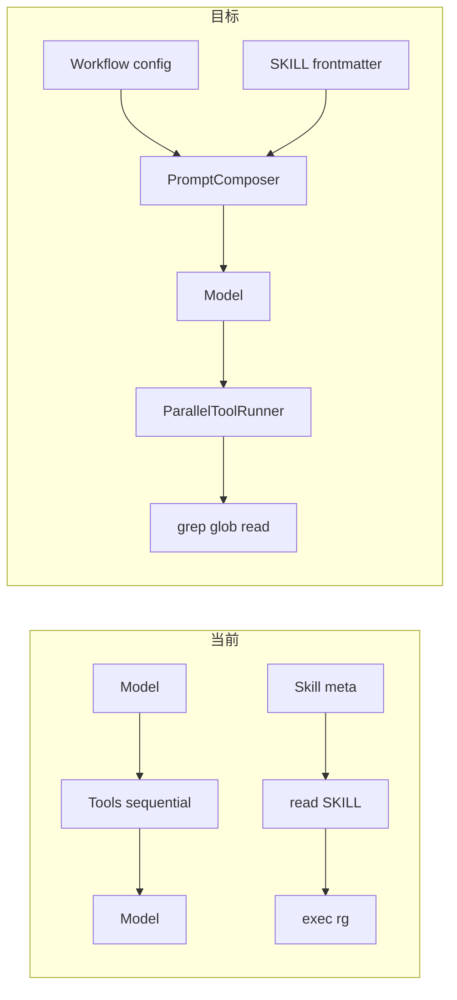

# OpenLum 智能体根本性效率优化

> **文档类型**：架构与路线图（设计定稿；实现过程中请同步更新「实施任务清单」与本文相关段落）。  
> **仓库路径**：`docs/AGENT_EFFICIENCY_ROADMAP.md`  
> **整理日期**：2026-04-09  
> **概要**：在保留 Skill 扩展的前提下，对齐 Cursor 类一等工具面（read / write / str_replace / grep / glob；不含启发式 semantic_search）；PDF/Word/Excel 等仍走 Skill + exec；宿主统一路径解析、并行与阶段可插拔；把高效用法沉淀为短规则与工具契约，而非写死长提示词。

## 实施任务清单（完成后请勾选）

- [x] **tool-surface-parity** — Tier1/Tier2 矩阵、`SystemPromptBuilder` 融合段落（`## Search → Read → Edit workflow`）、exec cwd 与 Tier1 相对路径短说明  
- [x] **path-contract-unified** — `WorkspacePathResolver`（`OpenLum.Console/IO/`）、Read/Write/ListDir/grep/glob/str_replace 同源校验、可教错误信息  
- [x] **strreplace-tool** — `str_replace` ITool（`StrReplaceTool.cs`）  
- [x] **native-grep-glob** — `GrepTool.cs`（纯 .NET regex）、`GlobTool.cs`、`group:search` in `ToolProfiles`  
- [ ] **semantic-search-v1** — 可选：离线索引或嵌入检索（**不**再使用已移除的 v0 启发式工具）  
- [x] **parallel-tool-exec** — AgentLoop 并行策略（ReadLike 并行 / WriteLike 串行）  
- [ ] **batch-read** — 多路径或 `read_many`、token 上限（read 已增加 offset 参数，多路径待后续）  
- [ ] **skill-frontmatter** — `summary_usage` / `delegates_to_tool`（待后续迭代）  
- [x] **prompt-composer-config** — 合并 `IntentPromptPrefix` 至 `SystemPromptBuilder`（已删除 AgentLoop 中的重复前缀）  
- [ ] **optional-workflow-phases** — WorkflowPhase、plan 通道、REPL 展示（待后续迭代）  

---

## 现状诊断（对应你提到的痛点）

### 1. 「search → read → think → fix → plan next」在系统里**没有机器保证，只有软提示**

- 编排逻辑在 `[OpenLum.Console/Agent/AgentLoop.cs](OpenLum.Console/Agent/AgentLoop.cs)`：`for` 循环 = **一轮模型 → 零或多工具 → 再一轮模型**，没有阶段状态机。
- 流程说明在 `[OpenLum.Console/Config/SystemPromptBuilder.cs](OpenLum.Console/Config/SystemPromptBuilder.cs)` 的 `## Execution Process` + 可选 `<thinking>...</thinking>`，以及 `[AgentLoop](OpenLum.Console/Agent/AgentLoop.cs)` 里对用户消息的 `IntentPromptPrefix`——**全是建议性文字**，模型可以忽略，也无法在运行时切换「只允许观察类工具」等策略。
- 结果：用户感觉「没有动作循环」，本质是 **单一 ReAct 回路**，没有可观测的 **Phase / Plan 工件**（除非模型自觉输出）。

### 2. Skills + rg 低效：**热路径被设计成「先 read SKILL 再 exec」**

- `[SkillLoader.FormatForPrompt](OpenLum.Console/Config/SkillLoader.cs)` 明确要求：`read` SKILL.md 再 `exec` skill exe——对安全、防幻觉是对的，但对 **高频、低歧义操作（如文本搜索）** 会变成固定 **2+ 回合**（read grep 文档 → exec rg）。
- 仓库里 `[OpenLum.Console/Skills/grep/SKILL.md](OpenLum.Console/Skills/grep/SKILL.md)` 把 ripgrep 放在 skill 里，通过 `exec` 调 `rg.exe`，没有一等公民的 `grep`/`rg` 工具；`[Application.cs](OpenLum.Console/Application.cs)` 注册的是 `read/write/list_dir/exec/...`，**没有搜索类原生工具**。
- `[ToolProfiles.cs](OpenLum.Console/Config/ToolProfiles.cs)` 仅有 `group:fs` / `group:runtime` 等，**没有 `group:search`**，策略层也无法表达「编码场景默认开搜索」。

### 3. 运行时未利用「可多工具并行」的常见模式

- `[AgentLoop](OpenLum.Console/Agent/AgentLoop.cs)` 对 `response.ToolCalls` 是 `foreach` **顺序** `ExecuteToolAsync`；若底层无共享锁，**独立工具调用本可并行**（例如同时 `grep` 多个模式、或 `read` 多个文件），能显著降低 wall-clock 时间。
- `read` 仅支持单路径（`[ReadTool.cs](OpenLum.Console/Tools/ReadTool.cs)`），模型想批量读要多次调用或自己拼 shell，进一步放大回合数。

### 4. 提示词重复与「策略写死」倾向

- `IntentPromptPrefix`（用户消息层）与 `## Execution Process`（系统层）**语义重叠**，增加 token，却仍不保证行为。
- 要「通用、可扩展、不写死一大段提示词」，需要把 **行为差异** 从散文挪到 **配置与契约**（见下文）。

---

## 对照「当前对话助手」的有效工作方式（抽象成可迁移能力）

以下不依赖具体提示词，而是 **能力组合**（你们实现时用接口 + 配置扩展即可）：

| 模式     | 作用             | OpenLum 缺口                  |
| ------ | -------------- | --------------------------- |
| 并行检索   | 语义/文件名/内容多路同时搜 | 无原生 grep/glob；exec 串行       |
| 批量精读   | 一次读多文件或限定行范围   | read 单文件                    |
| 显式计划工件 | 复杂任务列出步骤，减少乱试  | 无结构化 plan，仅靠 `<thinking>`   |
| 阶段化工具集 | 先只允许搜/读，再开放写   | 无阶段，仅 ToolPolicy 静态 profile |

---

## 根本性改造方向（按优先级）

### A. 一等公民「窄工具」——把高频能力从 Skill+exec 中抽出来（**不是**换提示词）

- 新增例如 `**grep`/`rg`**（包装与 skill 相同的 `rg.exe` 或系统 rg）、可选 `**glob`**，参数清晰：`pattern`、`path`、`glob`、`head_limit` 等，与 `[ReadTool](OpenLum.Console/Tools/ReadTool.cs)` 同源的路径校验策略。
- 语义上：**Skill 仍保留**（复杂用法、非标准安装、领域工具），但 **grep 类默认走工具**，避免每搜一次先 read SKILL。
- 在 `[ToolProfiles](OpenLum.Console/Config/ToolProfiles.cs)` 增加 `group:search`（或 `group:code` 含 search），并在 `[openlum.json` 配置](OpenLum.Console/Config/) 文档中说明如何按 profile 打开。

### B. 运行时编排：并行执行 + 可选「阶段插件」（数据驱动，不写死长提示）

- **并行**：在 `[AgentLoop](OpenLum.Console/Agent/AgentLoop.cs)` 对同一轮多个 `ToolCall` 做依赖分析（同名工具、写同一文件等保守串行；其余 `Task.WhenAll`）。接口层可在 `[OpenLum.Core` 的 `ITool`/会话契约](OpenLum.Core/Interfaces/) 旁增加 `IToolExecutionStrategy`（可选），默认并行安全集由配置列出。
- **阶段（可选、可插拔）**：引入 **配置或插件** 描述的 `WorkflowPhase`（例如 `Observe | Act | Verify`），每阶段：
  - 仅向模型暴露**允许的 tool 名称子集**（复用 `[ToolPolicyFilter](OpenLum.Console/Tools/ToolPolicyFilter.cs)` 思路，但是**按 turn/阶段动态**），或
  - 在阶段切换时注入**短系统补丁**（一行规则，而非整页散文）。
- 实现上可把「提示拼装」从 `[SystemPromptBuilder](OpenLum.Console/Config/SystemPromptBuilder.cs)` 拆成 `**IPromptComposer`**：静态基底 + 阶段片段 + 用户策略文件，**长文默认进配置文件/模板，而非硬编码 C# 常量**。

### C. Skill 契约扩展（机器可读，减少「必须先 read 全文」）

- 在 `SKILL.md` frontmatter 中增加可选字段（由 `[SkillLoader.ParseFrontmatter](OpenLum.Console/Config/SkillLoader.cs)` 解析），例如：
  - `summary_usage:` 一两行「无 read 时的安全用法」（仅当 skill 作者愿意提供）；
  - 或 `delegates_to_tool: grep` 表示与某原生工具等价，宿主可跳过重复说明。
- `[FormatForPrompt](OpenLum.Console/Config/SkillLoader.cs)` 把 `summary_usage` 注入 `<skill>`，使模型在 **90% 场景** 不必先 `read` 完整 SKILL。

### D. 可选「计划工件」通道（通用、可扩展）

- 不强制 XML；可提供轻量约定：例如模型输出 `<plan>...</plan>` 或单独 tool `submit_plan`，由 REPL **仅展示/记录**，不占用工具回合——与现有 `<thinking>` 展示逻辑对齐（需在 Console REPL 侧可查）。
- 与 B 结合：进入 `Act` 阶段前要求存在 plan（仅复杂任务可由启发式或用户 `/deep` 打开），避免「写死提示词」又保留结构化节奏。

### E. 清理重复策略文本

- 将 `IntentPromptPrefix` 与 `## Execution Process` **合并为一处**（配置或单一 builder），避免用户消息与系统消息双份「先想清楚」。

---

## 架构关系（提议）

---

## 建议落地顺序（便于迭代）

1. **原生 `grep`（+并行执行）** — 立竿见影减少回合与耗时。
2. `**read` 多路径或专用 `read_many`** — 减少批量调查时的调用次数。
3. **SkillLoader frontmatter 扩展 + PromptComposer 外置长提示** — 可扩展、少写死 C#。
4. **可选阶段工作流 + plan 展示** — 解决「没有循环感」的体验问题。

---

## 风险与约束（及对应解法）

### 1. 并行工具与竞态

**问题**：同一轮内多个 `write`/`exec` 可能写同一文件或同目录产物，产生非确定结果。

**解法（可组合）**：

- **工具分级**：在调度层把工具分为 `ReadLike`（grep/read/list_dir）、`WriteLike`（write）、`ShellLike`（exec）、`SpawnLike`（sessions_spawn）。默认策略：**同轮内 ReadLike 可并行**；**WriteLike 与同路径 ReadLike 串行**；**exec 默认串行**（或仅当静态分析确定无文件写冲突时并行，由配置 `execParallel: false` 保守默认）。
- **路径冲突检测**：对同一轮 `ToolCall` 解析参数中的目标路径（规范化后）；若两调用均可能写同一 `fullPath`，强制顺序执行或合并为一次调用并返回明确错误。
- **显式锁（可选）**：子阶段「只允许只读工具」时根本不会并发写，从流程上消掉一大类竞态。

### 2. 放宽「先 read SKILL」与 Exec 校验

**问题**：原生 `grep` 减少回合，但 skill+exe 路径仍依赖 `ExecTool` 防幻觉。

**解法**：

- **两档策略**：**档 A**——与原生工具等价的能力（grep）走 `ITool`，不经过 skill 文案；**档 B**——仍走 exec 的 skill 必须满足现有校验 + 可选 frontmatter `summary_usage`（作者背书的一行安全用法），**不**默认全局跳过 `read SKILL`。
- **delegates_to_tool**：仅在元数据声明与某原生工具等价时，宿主可在提示里写「优先用工具 X」，而不是绕过 exe 存在性检查。

### 3. 子代理（sessions_spawn）与主循环策略一致

**问题**：主会话若引入阶段/并行/新工具，子会话仍用旧 `AgentLoop` 配置会行为漂移。

**解法**：

- **配置单点注入**：`maxToolTurns`、并行策略、`IPromptComposer` 输出、工具注册表 **同一工厂** 构造主 `AgentLoop` 与 `SessionsSpawnTool` 内嵌循环（已有同一 `systemPrompt`/`toolsFiltered` 思路，扩展时保持「子集 = 去掉 sessions_spawn」即可）。
- **子代理专用短补丁**（已有类似做法）：仅追加「与子任务边界、禁止重复主任务」相关的规则，**不**复制整页系统提示的第二份散文。

---

## 何时「适当」使用子智能体（设计原则，非提示词堆砌）

子智能体适合 **任务隔离、并行探索、上下文预算** 三类场景；不适合 **强一致编辑流水线** 或 **极短任务**。

| 更适合 spawn                                                  | 更适合主会话直接工具                                |
| ---------------------------------------------------------- | ----------------------------------------- |
| 独立子问题（如「只调研某目录并给结论」），结果可合并为一段摘要                            | 连续改同一批文件、需要用户随时插话对齐需求                     |
| 可能与主线程并行的心理「探路」（若产品层支持多 spawn，需注意 workspace 写冲突——只读子任务更安全） | 单文件小改、几步 grep+read+write 能完成              |
| 子任务会消耗大量工具回合/长上下文，需保护主会话窗口                                 | 子任务与主任务高度重叠（易重复劳动，已有提示：收到 spawn 结果后勿再重复搜） |

**实现向**：可在配置中增加启发式，例如「仅当用户显式 `/spawn` 或任务描述含多独立 Deliverable 时才注入 sessions_spawn」，避免模型滥用；与「阶段化」结合时，**Observe 阶段不开放 spawn**，减少无效分叉。

---

## 工具对照：本对话助手 vs OpenLum（避免概念混淆）

- **本环境（Cursor 里的我）**：文件读写主要用 **专用工具** `Read`、`Write`、`StrReplace`（以及 `Grep`、`Glob`、代码库搜索等），**不是**通过通用 shell 里 `Get-Content`/`echo` 完成；需要跑构建、脚本时才用 **终端类工具**（如 `Shell`）。
- **OpenLum.Console**：对应能力是 `**read` / `write` 这两个 `ITool`**（见 `[Application.cs](OpenLum.Console/Application.cs)` 注册），语义上接近「受路径约束的读写 API」；通用命令行是 `**exec`（PowerShell）**。因此：**不是「shell 命令叫 read/write」**，而是 **宿主实现的工具名与 shell 动词碰巧相似**。

将上述对照写入计划，是为了后续设计「原生 grep」时明确：**grep 也应是独立 `ITool`，而不是教模型用 exec 调 rg**——与 Cursor 侧「Grep 工具优先于自己拼 shell」一致。

---

## 目标：与 Cursor 类助手对齐的工具矩阵 + 与 Skill 融合（Learning from assistant）

### 两档能力（融合，不拆成两套产品）

| 档位                      | 内容                                                                                                                                      | 说明                                                                                                                                         |
| ----------------------- | --------------------------------------------------------------------------------------------------------------------------------------- | ------------------------------------------------------------------------------------------------------------------------------------------ |
| **Tier 1 — 原生 `ITool`** | `read`（可扩展 offset/limit/多路径）、`write`、`str_replace`、`text_edit`、`grep`、`glob`、保留 `list_dir`、`exec`、`memory_*`、`sessions_spawn` | 覆盖日常代码/文本的「搜—读—改」闭环；**不**经「先 read SKILL 再 exec」的热路径。工具名可与现有一致（`read`）或文档中并列英文别名（Read）以降低迁移成本。                                              |
| **Tier 2 — Skill**      | PDF、Word、Excel 等：沿用现有 `Skills/*/SKILL.md` + exe，经 `exec`（或未来 thin wrapper）                                                              | **特殊格式**不在 Tier1 里硬编码解析；在系统提示里写清：**遇到 `.pdf`/`.docx`/`.xlsx` 等 → 按 `<available_skills>` 选用对应 skill**（可先 `summary_usage` 或 `read` 短 SKILL）。 |

**融合点**：在 `[SystemPromptBuilder](OpenLum.Console/Config/SystemPromptBuilder.cs)`（或未来的 `IPromptComposer`）用**一节短规则**统一说明：

- 普通文本/源码：优先 **grep / glob → read（带范围）→ str_replace 或 write**；
- 检测到特殊扩展名或用户明确要求：走 **pdf / docx / xlsx** 等 Skill，禁止用纯 `read` 当万能钥匙读二进制。

可选：**ReadTool** 在打开非文本扩展名时返回一行**路由提示**（「请使用 pdf skill」），与 Cursor 里读不了时给指引类似——实现时注意与现有错误信息风格一致。

### 从「本对话环境助手」可迁移的技巧（写入工具描述与短策略，而非千字散文）

以下作为 **ToolDescription / 配置片段** 的可选模板，保持可扩展、可本地化：

1. **检索顺序**：大文件或陌生仓库 → 先用 **glob** 缩小文件集，再用 **grep** 定位行，再 **read** 局部。
2. **修改策略**：小范围改动优先 **str_replace**（唯一匹配、可 `replace_all`），整文件覆盖再用 **write**；减少 diff 噪声与误覆盖。
3. **并行**：无依赖的 **grep/read/glob** 同一轮多调用；与「并行工具执行」运行时改造一致。
4. **Token**：`read` 带 `limit`/行范围；避免一次性读超大文件。
5. **Skill**：仅当 Tier1 无法处理格式时再 **read SKILL.md 或 summary_usage + exec**；与现有 Exec 校验兼容。

### 未来可选：真·语义 / 索引检索（与已移除的 v0 区分）

- **当前**：Tier1 仅 **grep + glob**（已移除易误导的 v0 `semantic_search` 启发式工具）。
- **v1（可选后续）**：工作区离线索引（倒排 + 路径过滤，或轻量嵌入），以**新工具名**或明确版本暴露，避免与「语义」一词混淆。
- **v2+**：增量索引、`.gitignore` 尊重、大仓性能——按产品节奏迭代。

### 与现有 todos 的对应关系

- `tool-surface-parity`：融合段落 + 路由提示策略。  
- `path-contract-unified`：路径解析单点、exec 与 Tier1 语义一句说清。  
- `strreplace-tool`：`str_replace`。  
- `native-grep-glob`：`grep` + `glob`。  
- `semantic-search-v1`：若做索引/嵌入，另立契约与工具名。  
- 其余（并行、批量读、frontmatter、PromptComposer、阶段）支撑上述用法。

---

## Workspace 与路径：如何让智能体「正确区分」相对与绝对（借鉴思路，不靠啰嗦提示）

### 核心原则：**宿主统一解析，模型只负责传「用户意图」路径**

与 Cursor 类环境类似：系统提示里已有 `**Workspace: <绝对路径>`**（见 `[SystemPromptBuilder](OpenLum.Console/Config/SystemPromptBuilder.cs)`）。正确做法是：

1. **单一真源**：所有 Tier1 工具在内部用同一套 `**ResolvePath(path) → fullPath`**（与现有 `[ReadTool](OpenLum.Console/Tools/ReadTool.cs)` 一致：已 `Path.IsPathRooted` 则规范化后校验；否则 `**Path.Combine(workspace, relative)`**）。
2. **允许范围**：仅允许落在 **workspace 前缀** 下，或 **skill 根**（`_extraReadRoots`）等显式白名单——与现有一致，避免「任意绝对路径」失控。
3. **错误信息可教**：校验失败时返回 **规范化后的 fullPath + 期望的 workspace**，模型下一轮可自动改为相对或修正前缀——比长文规则有效。

这样智能体**不必在脑子里区分「两种世界」**：传 `foo/bar.cs` 或传 `D:/ws/foo/bar.cs`（在允许范围内）**应得到同一结果**；区分工作交给代码。

### 何时用相对、何时用绝对（给模型的短规则，可进工具描述 / PromptComposer）

| 场景                           | 建议                                                              |
| ---------------------------- | --------------------------------------------------------------- |
| 操作当前仓库内文件                    | **优先 workspace 相对路径**（`src/A.cs` 或 `./src/A.cs`），短、可移植、少 token。 |
| 用户粘贴了完整路径                    | **原样传绝对路径**；宿主规范化后若仍在 workspace 内则通过。                           |
| 跨机器/文档里写的路径与当前 workspace 不一致 | 用 **相对 workspace** 或只写 **从仓库根起的相对段**，避免硬编码盘符。                   |
| Skill / 读 `SKILL.md`         | 用列表里的 **location**（常为绝对或 skills 下相对），与现有一致。                     |

**本对话助手侧的可借鉴点**：工具参数里路径是「字符串」；**底层**始终有 workspace 根；助手被鼓励对项目内文件用相对路径，对用户给的绝对路径照抄——**OpenLum 用同一套 Resolve 即可复现该体验**。

### `exec` 与普通 `read`/`grep` 的差异（必须写清一句，否则必混）

- `**read` / `write` / `grep` / `glob`（Tier1）**：参数路径走 `**ResolvePath`，相对 = 相对 workspace**。  
- `**exec`**：进程 **cwd 默认为 workspace**（见 `[ExecTool](OpenLum.Console/Tools/ExecTool.cs)`），因此 **shell 里的相对路径 = 相对 workspace**，不是「相对当前文件」。Skill exe 会改 cwd 为 exe 目录——已在现有逻辑中。

计划在 **SystemPromptBuilder 增加固定短句**（或 `IPromptComposer` 片段）：「**exec 内相对路径相对于 Workspace；Tier1 文件工具的路径参数亦相对于 Workspace（绝对路径在允许范围内亦可）。**」

### 若用户指定「工作区外的目录」作项目根

当前 OpenLum 的 workspace 来自配置（`openlum.json` 等），**一次会话一个根**。若未来支持多根或「在对话里切换 workspace」，应通过 **显式配置/命令** 改 `Workspace:`，而不是让模型用 `..` 逃出——安全边界仍在宿主。

### 可选实现增强（执行阶段再定）

- 工具返回成功结果时附带 `**resolvedPath`**（一行），便于日志与多步引用。  
- `glob`/`grep` 的 `path` 参数默认 `.` 即 workspace 根，与 ripgrep 习惯一致。

### 如何实现：宿主统一解析（落地步骤）

1. **抽出共享类型**（建议放在 `OpenLum.Console` 下如 `Workspace/WorkspacePathResolver.cs` 或 `IO/WorkspacePaths.cs`）：
  - 入参：`workspaceRoot`（full path）、`extraAllowedRoots`（skill 根等）、用户传入的 `path` 字符串。  
  - 步骤：沿用现有 `ExpandPath`（`~`）→ 若非 rooted 则 `Path.Combine(workspace, relative)` → `**Path.GetFullPath` 规范化**（关键：消化 `..`/`.`，防止逃出 workspace）。  
  - 校验：`fullPath.StartsWith(workspaceRoot)`（大小写不敏感）或对 `extraAllowedRoots` 逐一前缀匹配；**两者都不满足则拒绝**。  
  - 返回：推荐 `record PathResolution(Ok fullPath | Err message)`，错误信息包含 `workspaceRoot` 与尝试解析后的路径。
2. **重构现有工具**：`ReadTool` / `WriteTool` / 未来的 `grep`/`glob`/`str_replace` **只调 Resolver**，删除重复的 `IsPathAllowed`/`ExpandPath` 拷贝（或把 `ExpandPath` 收进 Resolver 私有）。
3. **单元测试**：针对 Resolver 单测（相对路径、`..` 逃逸、绝对路径在边界上、Windows 盘符、`~`、skill 根下的路径）；工具层可做少量集成测。
4. `**exec` 不动解析模型**：`exec` 仍接收整条命令字符串；仅在文档与系统提示中说明 **cwd=workspace**。若未来要对 exec 内路径做校验，可另议（复杂度高），与 Tier1 分离。
5. **与 todo 对齐**：实现对应计划中的 `path-contract-unified`。

---

## 更多「宝贵知识」：同类原则（宿主扛不变量，模型只出意图）

下列与「路径统一解析」**同一哲学**：少写死提示词，多把规则做成 **代码 + 窄 API + 可教错误**。

| 原则           | 含义                   | OpenLum 中可落点                                                  |
| ------------ | -------------------- | ------------------------------------------------------------- |
| **安全边界在宿主**  | 不信任模型能「自觉」不越权        | 路径白名单、`ToolPolicyFilter`、`ExecTool` skill exe 存在性校验           |
| **预算是宿主切的**  | 不靠「请简短」保证 token      | `maxToolResultChars`、read 行数上限、会话压缩 `SessionCompactor`        |
| **结构化失败可纠错** | 错误带机器/人可读线索          | `Error: ...` + 规范化路径；可选错误前缀便于日志检索                             |
| **确定性优先**    | 同一输入应得可预期结果          | `str_replace` 要求唯一匹配或显式 `replace_all`；避免模糊覆盖                  |
| **调度策略属宿主**  | 并行/串行、阶段工具子集         | `AgentLoop` 并行策略、未来 `WorkflowPhase`                           |
| **会话与角色属宿主** | 模型不直接改存储格式           | `ISession`、`ChatMessage`、tool 结果顺序与 OpenAI 约束（见 AgentLoop 注释） |
| **单源配置**     | Workspace、模型、工具策略一处改 | `ConfigLoader` / `openlum.json`；避免多处硬编码路径规则                   |

**与路径解析并列、最值得优先落地的**：**统一的 `WorkspacePathResolver` + 全 Tier1 接入**；其余原则在实现新工具时逐项对齐即可。

---

## 文档维护与归档说明

- **权威副本**：以本仓库 `docs/AGENT_EFFICIENCY_ROADMAP.md` 为准；若在 Cursor 或其它环境中有同名计划副本，重大变更应合并回本文，避免双源漂移。  
- **实施闭环**：每完成「实施任务清单」中一项，请在 PR/提交说明中引用对应小节；全部完成后可将清单整体替换为简短「实施状态：已完成（日期）」并保留正文作长期架构参考。  
- **评审与扩展**：新增工具、Skill 契约或路径策略时，优先更新本文「根本性改造方向」「Workspace 与路径」「同类原则」诸节，再改代码，便于后续贡献者对齐设计意图。
